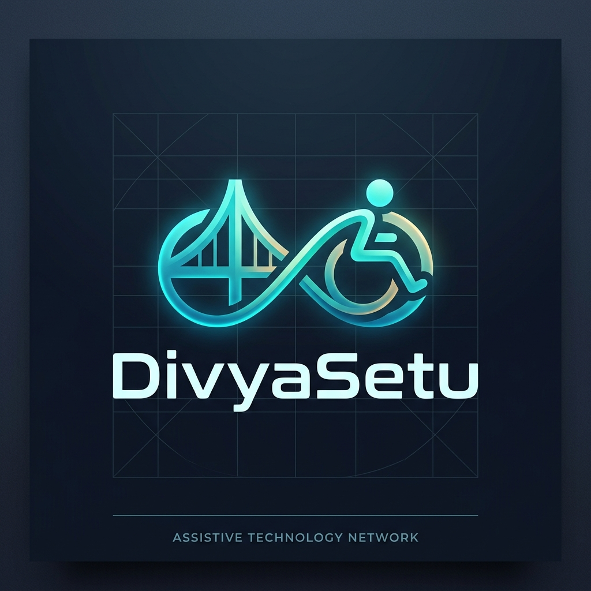

<p align="center">
  
</p>

<h1 align="center">DivyaSetu (दिव्यसेतु)</h1>
<h3 align="center">Assistive Device Access & Redistribution Network</h3>

<p align="center">
  
  
  
  
  
  
  
  
  
</p>

<p align="center">
  
  
  
  
</p>

---

## Table of Contents

- [Problem Statement](#problem-statement)
- [Abstract](#abstract)
- [Objectives](#objectives)
- [How It Works](#how-it-works)
- [Technology Stack](#technology-stack)
- [System Architecture](#system-architecture)
- [Database Design](#database-design)
- [DBMS Concepts Demonstrated](#dbms-concepts-demonstrated)
- [Matching Algorithm](#matching-algorithm)
- [Scoped AI Assistant](#scoped-ai-assistant)
- [API Endpoints](#api-endpoints)
- [Application Interfaces](#application-interfaces)
- [Project Structure](#project-structure)
- [Installation & Setup](#installation--setup)
- [License](#license)

---

## Problem Statement

Persons with disabilities across India who require mobility, hearing, or vision assistive devices—including wheelchairs, hearing aids, crutches, tricycles, Braille kits, and prosthetics—often depend on periodic, offline distribution camps organized by government agencies and non-governmental organizations. Between these camps, there is no standardized digital channel enabling operational devices lying idle in donor households or medical facilities to reach individuals who urgently need them.

### Structural Challenges

| Challenge | Impact |
|-----------|--------|
| **Frequency Mismatch** | Distribution camps occur episodically, whereas physical rehabilitation and emergency mobility needs are continuous. |
| **Geographic Disparity** | Surplus devices concentrate in urban centers, while unfulfilled demand is highest in rural and semi-urban districts. |
| **Verification & Trust** | Pre-owned assistive gear often lacks safety certifications, discouraging potential beneficiaries and donors. |
| **Information Asymmetry** | Organizations lack centralized, real-time demand telemetry to coordinate regional distribution efficiently. |
| **Circulation Inefficiency** | Usable devices are retired permanently after primary recovery rather than entering a circular lifecycle. |

> DivyaSetu transforms episodic distribution into a continuous, location-aware redistribution network. It provides verified condition logging, geospatial PostGIS matching, transactional claim allocations, and cyclical re-listing.

---

## Abstract

DivyaSetu (दिव्यसेतु — "Divine Bridge") is a full-stack assistive technology platform engineered to manage the entire redistribution lifecycle:

1. **Donation Intake**: Donors register idle assistive assets with specifications, location coordinates, and operational history.
2. **Quality Certification**: Verified technical inspectors evaluate devices against standardized safety guidelines (`SAFE` / `NOT_SAFE`).
3. **Geospatial & Multi-Criteria Matching**: A PostgreSQL/PostGIS engine evaluates Euclidean spatial proximity alongside urgency, device category, and demand saturation.
4. **Transactional Handover**: Full ACID transactions with row-level locking (`SELECT ... FOR UPDATE`) ensure safe allocation, strictly eliminating race conditions and double-claims.
5. **Circularity**: Post-delivery feedback and condition reassessments allow beneficiaries to re-list devices when no longer needed.

The platform demonstrates **14 load-bearing Database Management System (DBMS) concepts**, including spatial indexing (GiST), trigger-based immutable audit logging, stored procedures, SQL analytical window functions, common table expressions (CTEs), and strict database-level role-based access control (RBAC).

---

## Objectives

- **Continuous Access**: Replace sporadic offline camps with an always-available redistribution registry.
- **Verification Integrity**: Establish an immutable ledger for every device, documenting technical inspections, verdicts, and chain of custody.
- **Geospatial Optimization**: Pair devices with beneficiaries using PostGIS radius queries (`ST_DWithin`) to minimize logistics overhead.
- **Fair Allocation**: Apply multi-criteria scoring prioritizing acute clinical urgency and socioeconomic need.
- **Concurrency Control**: Guarantee transactional atomicity and zero double-allocation via database row locks.
- **Accessible Design**: Deliver WCAG-compliant web interfaces alongside assisted onboarding pathways for non-smartphone users.

---

## How It Works

### Circulation Lifecycle

```
[ DONOR ] ────► List Device (specs, photos, location)
                     │
                     ▼
[ VERIFIER ] ──► Physical Inspection & Certification (SAFE / NOT_SAFE)
                     │
                     ▼
[ ENGINE ] ────► PostGIS Proximity Filter + Urgency Scoring (Top-3 Recommendations)
                     │
                     ▼
[ SEEKER ] ────► Accept Allocation (ACID Row-Locking Transaction)
                     │
                     ▼
[ LOGISTICS ] ─► Transfer Tracking & Delivery Handover
                     │
                     ▼
[ CIRCULARITY ]► Beneficiary Feedback & One-Click Re-listing
```

### Device State Machine

```
AVAILABLE ──► CERTIFYING ──► MATCHED ──► IN_TRANSIT ──► DELIVERED ──► RE_LISTED
```

Every state transition triggers an automated entry in the PostgreSQL `audit_log` table, preserving an immutable chain of custody.

---

## Technology Stack

| Layer | Component | Technical Role |
|-------|-----------|----------------|
| **Frontend** | React 18, Vite, Tailwind CSS | Single-page application architecture with responsive design tokens |
| **State & Data Fetching** | TanStack React Query, Axios | Server-state caching, optimistic UI updates, background synchronization |
| **Backend API** | Node.js, Express, TypeScript | RESTful routing, authentication pipelines, transactional service orchestration |
| **Database** | PostgreSQL 16 + PostGIS 3 | Relational data persistence, ACID transactions, native spatial geometry operations |
| **Object-Relational Mapping** | Prisma 5 | Type-safe database queries, migration versioning, and client generation |
| **Authentication & RBAC** | JWT, bcrypt | Secure credential hashing and role-gated endpoints (Donor, Seeker, Verifier, Admin) |
| **Spatial Engine** | PostGIS `geometry(Point, 4326)` | GiST indexing and spatial distance predicates (`ST_DWithin`) |
| **AI Query Service** | Python 3.11, FastAPI, LangChain 0.2 | Natural language to SQL query engine operating under a dedicated read-only database role |
| **Infrastructure** | Docker Compose | Standardized container orchestration for PostgreSQL and PostGIS extensions |

---

## System Architecture

```
                       +----------------------------------------+
                       |      React SPA (Vite + Tailwind)       |
                       +----------------------------------------+
                                           |
                                    REST / JSON (JWT)
                                           v
                       +----------------------------------------+
                       |          Express API Gateway           |
                       |       (Authentication & RBAC)          |
                       +----------------------------------------+
                                /                      \
                    Read / Write (Prisma)         REST Query
                              /                          \
                             v                            v
               +---------------------------+   +----------------------+
               |    PostgreSQL 16 + PostGIS|   | FastAPI AI Assistant |
               |---------------------------|   | (Read-Only DB Role)  |
               | - GiST Spatial Indexes    |   +----------------------+
               | - Row-Level Lock Engine   |              |
               | - Triggers & Procedures   |<-------------+
               | - Aggregation Views       |   SELECT-Only Queries
               +---------------------------+
```

### Architectural Separation
- **Transactional Gateway (Express)**: Manages authentication, asset mutations, matching logic, and multi-table ACID transactions.
- **Analytical AI Service (FastAPI)**: Serves natural-language queries. To enforce structural security, the AI service connects using an isolated database user granted strictly `SELECT` permissions. Even in the event of an adversarial prompt injection, database mutations are blocked at the database engine level.

---

## Database Design

The relational schema comprises **11 core tables** modeled in Third Normal Form (3NF):

| Table | Description | Key Attributes |
|-------|-------------|----------------|
| `users` | System actors across all four roles | `id`, `name`, `mobile`, `role`, `language`, `disability_type`, `geometry`, `approved` |
| `device_types` | Standardized catalog of assistive categories | `id`, `category` (wheelchair, hearing-aid, crutch, tricycle, braille, prosthetic) |
| `devices` | Assistive assets and status tracking | `id`, `donor_id`, `type_id`, `condition`, `description`, `geometry`, `status`, `listed_at` |
| `needs` | Demand records submitted by beneficiaries | `id`, `seeker_id`, `category`, `urgency_hours`, `geometry`, `monthly_income`, `status` |
| `certifications` | Inspection decisions by qualified verifiers | `id`, `device_id`, `verifier_id`, `verdict`, `certificate_ref`, `inspected_at` |
| `matches` | System-generated compatibility recommendations | `id`, `device_id`, `need_id`, `match_score`, `source`, `status` |
| `transfers` | Logistics chain from pickup to handover | `id`, `match_id`, `pickup_addr`, `dropoff_addr`, `porter_id`, `status`, `delivered_at` |
| `feedback` | Post-allocation ratings and re-list intents | `id`, `transfer_id`, `rating`, `notes`, `re_list_intent` |
| `audit_log` | Append-only system audit trail | `id`, `table_name`, `record_id`, `action`, `payload`, `actor_id`, `created_at` |
| `otps` | Mobile verification challenge tokens | `id`, `mobile`, `code`, `used`, `expires_at` |
| `notifications` | Role-based contextual alerts | `id`, `user_id`, `type`, `payload`, `seen` |

Detailed schema documentation, including column types, constraints, and relationships, is available in [`docs/ER-diagram/schema.md`](docs/ER-diagram/schema.md).

---

## DBMS Concepts Demonstrated

All 14 concepts are functional components within the operational codebase:

| No. | Relational Concept | Implementation Details |
|:---:|-------------------|------------------------|
| 1 | **Normalization (3NF)** | Entities (`users`, `devices`, `needs`, `matches`) are decomposed to eliminate redundancy and update anomalies. |
| 2 | **Referential Integrity** | Foreign key constraints with explicit delete and cascade rules ensure relational consistency. |
| 3 | **Domain & Check Constraints** | Enforced checks on non-negative income, certification status enums, and mobile uniqueness. |
| 4 | **ACID Transactions & Row Locking** | High-concurrency matching via `SELECT ... FOR UPDATE` row locks, preventing race conditions where two seekers attempt to claim the same device simultaneously. |
| 5 | **Triggers (PL/pgSQL)** | Automated database trigger recording audit entries in `audit_log` on match creations and device state changes. |
| 6 | **Stored Procedures** | Database function `safe_to_transfer(device_id)` verifying safety certifications prior to state modification. |
| 7 | **Database Views** | `district_device_summary` aggregating regional supply versus demand metrics across geographical districts. |
| 8 | **Window Functions** | `ROW_NUMBER() OVER (PARTITION BY need_id ORDER BY match_score DESC)` computing ranked top-3 allocations. |
| 9 | **Common Table Expressions (CTEs)** | Multi-stage SQL querying that filters spatial candidates before computing aggregate scores. |
| 10 | **GiST Geospatial Indexes** | PostGIS spatial index on `geometry` attributes (`Point, 4326`) for sub-millisecond radius lookups. |
| 11 | **B-Tree Indexes** | Composite and single-column indexes on high-cardinality foreign keys (`type_id`, `status`, `seeker_id`). |
| 12 | **Full-Text Search (tsvector)** | GIN-indexed full-text search across device catalog descriptions via `to_tsvector` and `plainto_tsquery`. |
| 13 | **JSONB Document Storage** | Dynamic event payloads within `audit_log.payload` supporting flexible metadata schemas without table alterations. |
| 14 | **Role-Based Access Control (RBAC)** | Multi-tier security comprising application JWT middleware and a dedicated PostgreSQL database user with restricted `SELECT` privileges. |

---

## Matching Algorithm

The matching engine pairs certified available devices with active beneficiary requests by combining spatial proximity with multi-attribute scoring:

$$\text{Score} = w_1 \cdot \text{ProximityScore} + w_2 \cdot \text{CategoryFit} + w_3 \cdot \text{UrgencyScore} - w_4 \cdot \text{DemandSaturation}$$

### Evaluation Pipeline
1. **Spatial Filtering**: Uses PostGIS `ST_DWithin` indexed by GiST to identify candidates within a specified geographic radius (e.g., 50 km).
2. **Category Alignment**: Requires strict compatibility between the device catalog classification and the seeker's disability requirement.
3. **Clinical Urgency**: Weights requests by time sensitivity (e.g., post-operative recovery or acute mobility loss).
4. **Ranking & Selection**: Executes an analytical window function (`ROW_NUMBER()`) inside a Common Table Expression to return the top 3 highest-ranking matches per need.

The resulting allocation is persisted in `matches` with full scoring transparency.

---

## Scoped AI Assistant

DivyaSetu includes a specialized natural-language query interface powered by FastAPI and LangChain. Rather than an unconstrained agent, it utilizes a deterministic pattern-matching engine that translates authorized analytical questions into parameterized SQL queries.

### Supported Query Scenarios
- **Regional Supply Lookups**: *"Show me certified wheelchairs available within 50 km of Chennai."*
- **Unmet Need Aggregations**: *"Top 10 urgent needs in Tamil Nadu that are still unmatched."*
- **Audit & Verification Delays**: *"Which devices have been pending inspection for more than 7 days?"*

### Structural Security
- **Database Engine Isolation**: The AI service connects via a dedicated PostgreSQL user (`divyasetu_ai`) granted exclusively `SELECT` privileges. Any update or delete attempt is rejected by the database engine.
- **Query Validation**: Inbound queries are sanitized and checked against strict SQL pattern allowlists prior to execution.

---

## API Endpoints

| Method | Endpoint | Access Role | Description |
|--------|----------|-------------|-------------|
| `POST` | `/api/auth/register` | Public | Register a new user with role assignment |
| `POST` | `/api/auth/login` | Public | Authenticate credentials and generate JWT token |
| `GET` | `/api/devices` | Authenticated | Browse available certified devices |
| `POST` | `/api/devices` | Donor | Submit an assistive device for listing |
| `GET` | `/api/devices/:id` | Authenticated | Retrieve complete device details and inspection ledger |
| `POST` | `/api/devices/:id/certify` | Verifier | Submit physical inspection verdict (`SAFE` / `NOT_SAFE`) |
| `GET` | `/api/needs` | Authenticated | List beneficiary demand requirements |
| `POST` | `/api/needs` | Seeker | Register a new device requirement with urgency level |
| `GET` | `/api/needs/:id/matches` | Seeker | Retrieve ranked match recommendations for a need |
| `POST` | `/api/matches/:id/accept` | Seeker | Concurrently claim an allocation via row-locked transaction |
| `POST` | `/api/transfers` | Admin | Initiate delivery dispatch for an accepted match |
| `PATCH` | `/api/transfers/:id/status`| Admin | Update logistics status (`IN_TRANSIT`, `DELIVERED`) |
| `POST` | `/api/transfers/:id/feedback` | Seeker | Submit beneficiary feedback and re-list readiness |
| `GET` | `/api/reports/district-aggregate` | Admin | Query district-level supply and demand aggregations |
| `POST` | `/api/ai/ask` | Authenticated | Execute natural-language analytical query |

Complete request and response schemas are documented in [`docs/SQL-recipes/recipes.md`](docs/SQL-recipes/recipes.md).

---

## Application Interfaces

The web client provides specialized dashboards tailored to each actor:

1. **Authentication Portal**: Role-differentiated registration and authentication with accessibility considerations.
2. **Device Discovery**: Interactive map and catalog displaying certified devices with spatial distance indicators.
3. **Device Digital Ledger**: Comprehensive asset view displaying technical condition, inspector credentials, and lifecycle status.
4. **Donor Management**: Interface for listing idle equipment, monitoring certification progress, and managing transfers.
5. **Seeker Portal**: Interface for submitting needs, viewing top-ranked recommendations, and claiming matched devices.
6. **Verifier Workbench**: Inspection queue allowing certified technicians to record diagnostics and sign off on device safety.
7. **Administrative Dashboard**: Operational overview featuring district supply-demand charts, transfer tracking, and immutable audit logs.
8. **Analytical AI Assistant**: Slide-out interface providing conversational data queries regarding network inventory and distribution metrics.

---

## Project Structure

```
divyasetu/
├── docker-compose.yml          # PostgreSQL 16 + PostGIS 3 container setup
├── .env.example                # Environment variables template
├── client/                     # Frontend application (React 18 + Vite + Tailwind)
│   ├── src/
│   │   ├── components/         # Reusable UI elements, Navigation, AI Drawer
│   │   ├── pages/              # Role-specific dashboard and discovery views
│   │   └── services/           # Axios API clients and query configurations
│   └── tailwind.config.js
├── server/                     # Backend API Gateway (Node.js + Express + Prisma)
│   ├── prisma/
│   │   ├── schema.prisma       # 11-table relational schema definition
│   │   ├── bootstrap.sql       # PostGIS extensions, triggers, stored procedures, views
│   │   └── seed.ts             # Realistic demographic and device seed dataset
│   └── src/
│       ├── routes/             # Authentication, Device, Need, Match, and Report APIs
│       └── services/           # Transactional workflows and PostGIS spatial queries
├── ai-service/                 # Natural language query engine (FastAPI + LangChain)
│   ├── main.py                 # FastAPI routing and SQL execution
│   └── assistant.py            # Few-shot prompt engineering and SQL generation
└── docs/                       # Technical documentation
    ├── assets/                 # Architecture diagrams and brand assets
    ├── ER-diagram/             # Schema entity-relationship documentation
    ├── SQL-recipes/            # Query recipes, triggers, procedures, and window functions
    └── demo-script.md          # End-to-end verification walkthrough
```

---

## Installation & Setup

### Prerequisites
- Node.js 18+ and npm
- Python 3.10+
- Docker and Docker Compose (or an existing PostgreSQL 16 instance with PostGIS)

### 1. Clone Repository and Configure Environment

```bash
git clone https://github.com/supergthe1269/DivyaSetu.git
cd DivyaSetu

# Create environment configuration
cp .env.example .env
```

### 2. Start PostgreSQL with PostGIS

```bash
docker compose up -d db
```

### 3. Initialize Database and Seed Data

```bash
cd server
npm install

# Run migrations to generate tables
npm run db:migrate

# Apply raw PostGIS triggers, stored procedures, and views
npm run db:bootstrap

# Seed realistic demonstration dataset
npm run db:seed
```

### 4. Run Application Services

Launch the services in separate terminal windows:

**Backend API Gateway:**
```bash
cd server
npm run dev
# Server listening at http://localhost:4000
```

**AI Analytical Service:**
```bash
cd ai-service
pip install -r requirements.txt
python -m uvicorn main:app --port 8488
# AI Service listening at http://localhost:8488
```

**Frontend Client:**
```bash
cd client
npm install
npm run dev
# Application accessible at http://localhost:5173
```

---

## License

This project is licensed under the MIT License. See the [LICENSE](LICENSE) file for details.
