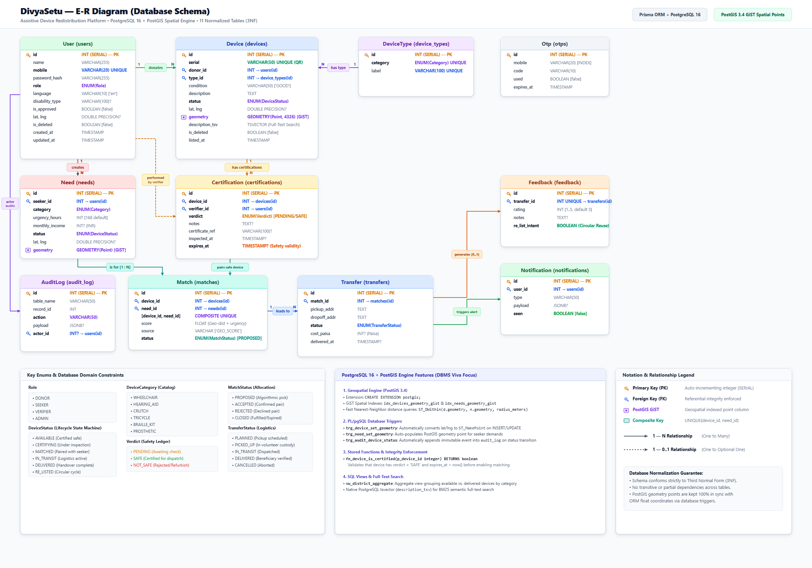
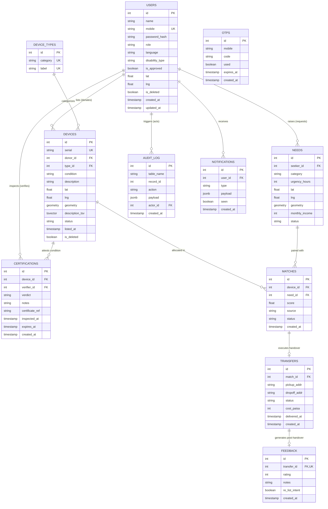

# DivyaSetu — ER Diagram & Relational Schema Specification
**Course**: BCSE302P – Database Systems Lab  
**Track**: T7 — Inclusion & Accessibility  
**Target Maturity**: TRL 4–5 Functional Prototype  

---

## 1. Entity-Relationship (ER) Diagram

  

  <em>Figure 1: DivyaSetu Complete E-R Diagram (PostgreSQL 16 + PostGIS Spatial Engine, 11 Tables, 3NF Compliant). <a href="er-diagram.svg">View Vector SVG</a></em>

### Interactive / Mermaid Representation

---

## 2. Relational Schema & Constraints

### 1. `users`
- **Primary Key**: `id`
- **Unique Constraint**: `mobile`
- **Check Constraints**: `role IN ('DONOR', 'SEEKER', 'VERIFIER', 'ADMIN')`
- **Indexes**: B-tree on `role`, `is_approved`

### 2. `device_types` (Reference Catalog)
- **Primary Key**: `id`
- **Unique Constraints**: `category`, `label`
- **Categories**: `WHEELCHAIR`, `HEARING_AID`, `CRUTCH`, `TRICYCLE`, `BRAILLE_KIT`, `PROSTHETIC`

### 3. `devices` (Asset & Digital Twin)
- **Primary Key**: `id`
- **Foreign Keys**: 
  - `donor_id` references `users(id)`
  - `type_id` references `device_types(id)`
- **Unique Constraint**: `serial`
- **Check Constraints**: `status IN ('AVAILABLE', 'CERTIFYING', 'MATCHED', 'IN_TRANSIT', 'DELIVERED', 'RE_LISTED')`
- **Indexes**: 
  - GiST index on `geometry` (`idx_devices_geometry_gist`)
  - B-tree on `type_id`, `status`, `donor_id`
  - GIN index on `description_tsv` for full-text search

### 4. `needs` (Beneficiary Demand)
- **Primary Key**: `id`
- **Foreign Key**: `seeker_id` references `users(id)`
- **Check Constraints**: `urgency_hours > 0`, `monthly_income >= 0`
- **Indexes**: 
  - GiST index on `geometry` (`idx_needs_geometry_gist`)
  - B-tree on `category`, `status`, `seeker_id`

### 5. `certifications` (Trust Ledger)
- **Primary Key**: `id`
- **Foreign Keys**: 
  - `device_id` references `devices(id)`
  - `verifier_id` references `users(id)`
- **Check Constraint**: `verdict IN ('PENDING', 'SAFE', 'NOT_SAFE')`
- **Indexes**: B-tree on `device_id`, `verifier_id`

### 6. `matches` (Matching Decision)
- **Primary Key**: `id`
- **Foreign Keys**: 
  - `device_id` references `devices(id)`
  - `need_id` references `needs(id)`
- **Composite Unique Constraint**: `(device_id, need_id)` — prevents duplicate proposal pairs
- **Check Constraint**: `status IN ('PROPOSED', 'ACCEPTED', 'REJECTED', 'CLOSED')`
- **Indexes**: B-tree on `need_id`, `status`

### 7. `transfers` (Logistics & Handover)
- **Primary Key**: `id`
- **Foreign Key**: `match_id` references `matches(id)`
- **Check Constraint**: `status IN ('PLANNED', 'PICKED_UP', 'IN_TRANSIT', 'DELIVERED', 'CANCELLED')`
- **Indexes**: B-tree on `match_id`

### 8. `feedback` (Post-Transfer & Circular Intent)
- **Primary Key**: `id`
- **Foreign Key**: `transfer_id` references `transfers(id)` (1-to-1 unique)
- **Check Constraint**: `rating BETWEEN 1 AND 5`

### 9. `audit_log` (Immutable Trust History)
- **Primary Key**: `id`
- **Foreign Key**: `actor_id` references `users(id)`
- **Columns**: `payload` stored as `jsonb`
- **Indexes**: Composite B-tree on `(table_name, record_id)`

---

## 3. Normalization Justification (3NF)

1. **First Normal Form (1NF)**:
   - All attributes contain atomic values (e.g., coordinates decomposed to numeric `lat` and `lng`; discrete status enums).
   - No repeating groups or multivalued arrays; PostGIS `geometry` is managed as an internal spatial primitive.

2. **Second Normal Form (2NF)**:
   - All non-key attributes are fully functionally dependent on their respective primary keys.
   - Composite key `(device_id, need_id)` in `matches` has no partial dependencies; `score`, `source`, and `status` depend strictly on the complete pair.

3. **Third Normal Form (3NF)**:
   - No transitive dependencies exist. For example:
     - Device category label is not stored redundantly in `devices`; it resides in `device_types` and is referenced via `type_id`.
     - User disability status is not duplicated in `needs`; it is referenced via `seeker_id`.
     - Derived metrics (such as candidate match score and district supply aggregates) are computed via dynamic CTEs and Views (`vw_district_aggregate`), never stored statically.
